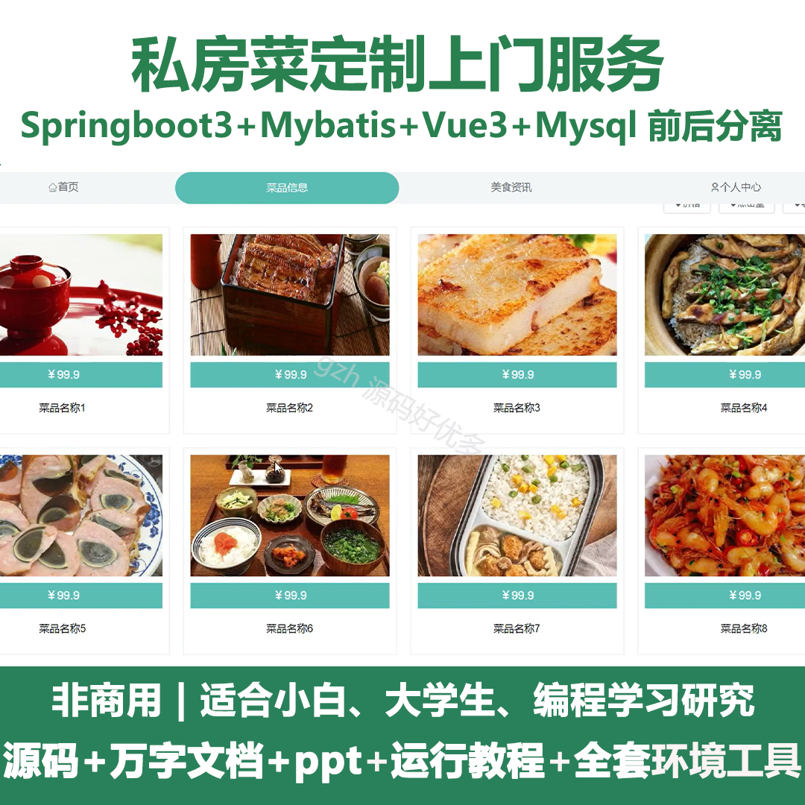
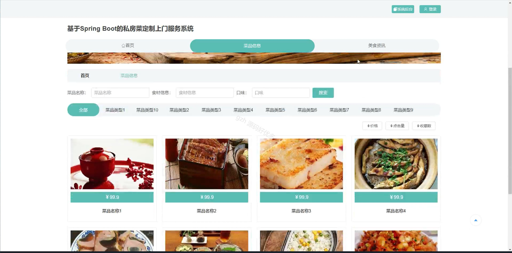
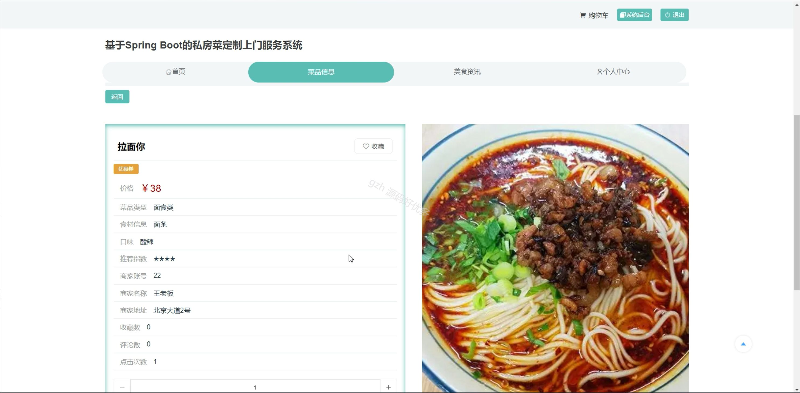
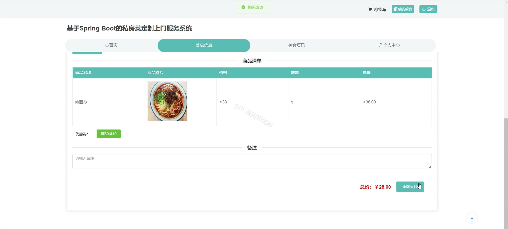
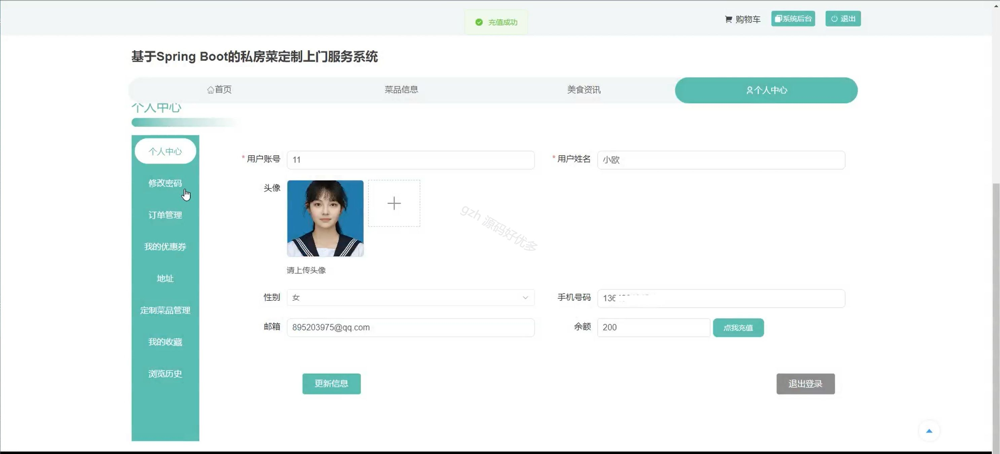
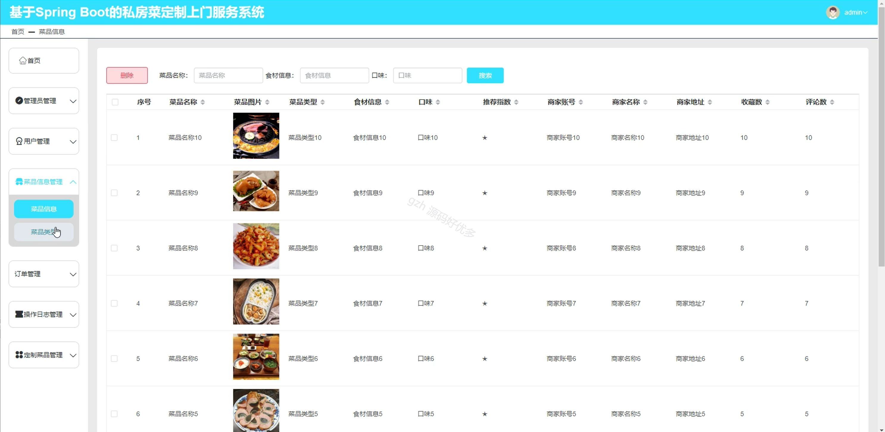
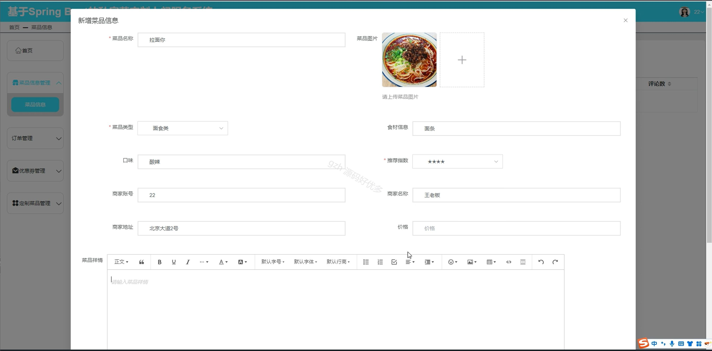
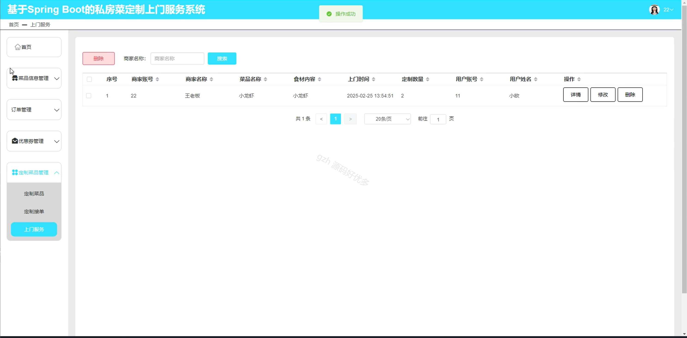
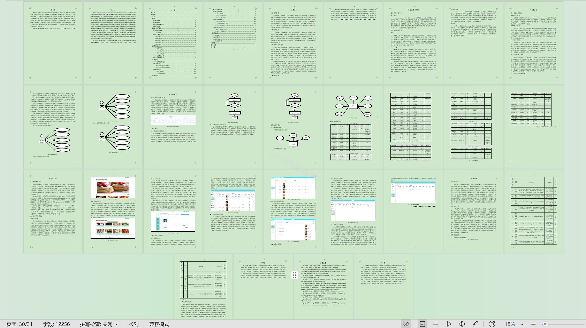

# springbootA512D
springbootA512D私房菜定制上门服务
## 查看主页获取源码

### 一、关键词

美食资讯、菜品信息、定制菜品

### 二、作品包含

源码+数据库+设计文档万字+ppt+全套环境和工具资源+部署教程

### 三、项目技术

前端技术：Html、Css、Js、Vue3.0、Element-plus
后端技术：Java、SpringBoot3.0、MyBatis

  

### 四、运行环境（以下版本亲测，其他版本未知，请自测）

开发工具：IDEA/eclipse  + VSCODE

数据库：MySQL5.7（最低要5.7版本）

数据库管理工具：Navicat10以上版本

环境配置软件： jdk17 + Maven3.6.3

前端Nodejs：20

浏览器：谷歌浏览器

### 五、项目介绍

项目编号：springbootA512D

私房菜定制上门服务能够依据客户个性化口味需求，在客户指定地点烹制特色美味菜肴，同时营造舒适私密用餐环境，让客户足不出户享受专属高品质餐饮体验。

角色：管理员、用户、商家

商家功能：首页、菜品信息管理、订单管理、优惠券管理、定制菜品管理。

管理员功能：首页、管理员管理、用户管理、菜品信息管理、订单管理、操作日志管理、定制菜品管理。

用户功能：首页、菜品信息、美食资讯、个人中心、购物车、修改密码、订单管理、我的优惠券、地址、定制菜品管理、我的收藏、浏览历史。

### 六、运行截图

